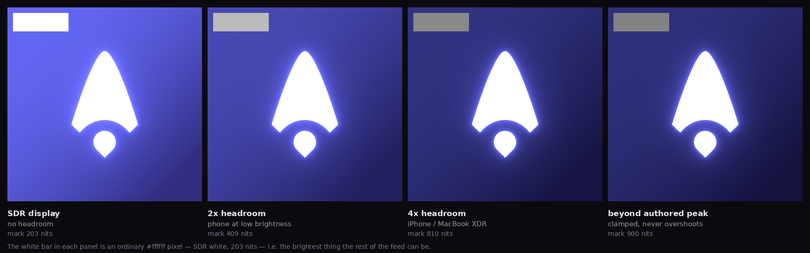

# Cotera HDR logo

Generates versions of the Cotera logo where the **arrow renders brighter than
white** on HDR-capable displays — the tile keeps its exact brand indigo, and the
arrow physically emits more light than anything else on the screen around it.



The four panels above are the same file at increasing display headroom. The
white bar in each is a plain `#ffffff` pixel — SDR white, the brightest thing an
ordinary image in a feed can be. As headroom grows the bar falls to grey while
the mark holds white. That is the whole effect: the logo does not look *whiter*,
everything else looks *dim*.

## What is actually going on

An ordinary image is relative. `#ffffff` means "as bright as this display shows
white", whatever that happens to be. Nothing in the file can ask for more.

HDR encodings break that ceiling in one of two ways:

**Absolute transfer functions (PQ / ST 2084).** The pixel value is a luminance
in cd/m² on a 0–10,000 scale. `0.7518` is not "pretty bright", it is *1000
nits*. A display with headroom above SDR white obeys, driving those pixels
harder than it drives a white pixel next to them. Signalled by CICP code
points — colour primaries, transfer characteristics, matrix coefficients,
range — carried in a PNG `cICP` chunk or an AVIF/HEIF `colr` (nclx) box.

**Gain maps (Ultra HDR / Adaptive HDR / ISO 21496-1).** The file is an ordinary
SDR JPEG plus a second, hidden image: a per-pixel map of how many stops to
brighten each pixel, and metadata saying how much headroom that map assumes.
A display with less headroom applies a proportionate fraction. A viewer that
has never heard of gain maps just shows the SDR image and is none the wiser.

The reference point that makes any of this meaningful is **203 nits**, the
SDR/diffuse-white level from ITU-R BT.2408. Authoring the mark at 800 nits is
asking for ~3.9× the light of the white pixels beside it in the feed.

## What this produces

```
python3 src/build.py --size square      # 1200x1200, standard feed image
python3 src/build.py --size portrait    # 1080x1350, most feed height on mobile
python3 src/build.py --size landscape   # 1200x627, link-preview shape
python3 src/build.py --size avatar      # 400x400, company page / profile
```

### Styles

`--style brand-tile` **(default)** — the logo exactly as drawn. The tile renders
at its true brand values (`#6366f2` lands on `#6366f2`, not a stretched
approximation of it), and only the white arrow and the light spilling off it go
above SDR white. This is the one that still reads as Cotera.

`--style indigo-mark` — the arrow alone, in brand indigo with a hotter core, on
a dark ground.

`--style white-mark` — the arrow alone, white, with an indigo halo.

Two details that matter in `brand-tile`: the tile is rendered at its *true*
sRGB values rather than normalised against its own brightest pixel (normalising
stretches `#6366f2` toward white and turns the deep indigo into lavender), and
the halo is composited **on top of** the tile rather than behind it — put it
behind and the tile simply hides it, which is the opposite of light spilling out
of the mark.

Each run writes, for that size:

| File | What it is | When to use it |
|---|---|---|
| `-ultrahdr.jpg` | Gain-map HDR JPEG: SDR base + gain map + `hdrgm` metadata | **Start here.** Correct on every display, glows where there is headroom. |
| `-hdr-pq.avif` | BT.2020 + PQ, 10-bit, CICP 9/16/9 | Cleanest HDR. Smallest file by far (~8 KB). |
| `-hdr-pq.png` | BT.2020 + PQ, 16-bit, `cICP`+`mDCV`+`cLLI` | Where only PNG is accepted. |
| `-sdr.png` / `-sdr.jpg` | No HDR tagging at all | The control, and the safe upload. |
| `-build.json` | Every parameter, plus measured scene statistics | Reproducibility. |

Intensity presets: `--preset subtle` (2.2× SDR white), `default` (4.4×),
`strong` (6.9×), `obnoxious` (11.8× — named as a warning, not a suggestion).
Or set it directly with `--peak 650 --bloom 260`. `--tile-nits` controls what
`#ffffff` inside the tile artwork means; at the default 203 the tile is exactly
the brand colour.

## What survives a re-encode — read this before posting

Measured, not assumed. The same file put through the processing an image
pipeline typically does:

| Processing | Result |
|---|---|
| Pillow re-save / resize | HDR data **destroyed** |
| ImageMagick re-save / resize | HDR data **destroyed** |
| `exiftool -all=` strip | HDR data **destroyed** |
| AVIF decode → re-encode | CICP tagging **lost** |

Nothing survives a re-encode. The effect only works where the platform serves
the original bytes back, so the practical question for any given surface is
whether it transcodes — not which format is most robust.

This is the strongest argument for the gain-map JPEG. When its gain map is
stripped, what remains is the authored SDR base: measured mean difference from
the intended SDR rendition, **0.58/255** — i.e. indistinguishable. When a PQ
file loses its `cICP` tag, the PQ-encoded values get read as sRGB and the image
breaks — **30.2/255** off, with the background washing from `#242263` to
`#3d395e`. The gain-map file degrades; the PQ file fails.

## Checking it

```
python3 src/validate.py out/*.jpg out/*.png out/*.avif
```

This parses the produced bytes rather than trusting the encoder: CRCs, chunk
ordering, CICP code points, the MPF index, and — the check that actually
matters for gain-map files — whether the recorded offset of the second image
lands exactly on a JPEG `SOI` marker.

To see the glow you need a real HDR display. Open `out/preview.html` on the
device in question; each encoding sits beside a `#ffffff` swatch for comparison,
and the page reports what the browser thinks the display can do.

## The pieces

- **`src/hdrkit.py`** — ST 2084 (PQ) and HLG transfer functions, BT.709↔BT.2020
  matrices, luminance helpers. Validated against the canonical PQ checkpoints
  (100 nits → 0.5081, 1000 nits → 0.7518).
- **`src/compose.py`** — builds the scene in linear nits as reusable layers, so
  the HDR and SDR renditions are the same artwork at different luminances
  rather than a tone-map of one another. Compositing and downsampling happen in
  linear light; averaging gamma-encoded pixels across a 4× brightness step is
  what produces the classic dark fringe around a glowing mark.
- **`src/encode.py`** — a 16-bit PNG writer emitting `cICP`/`mDCV`/`cLLI`
  directly. Pillow cannot write 16-bit RGB PNGs, and every other encoder stamps
  `gAMA`/`cHRM`/`sRGB` chunks that compete with `cICP`, so the file is built
  from scratch. Plus BT.2020/PQ AVIF via `avifenc`.
- **`src/ultrahdr.py`** — the gain-map JPEG: XMP GContainer directory, a
  CIPA DC-007 MPF index with patched offsets, and the gain map appended as a
  second JPEG carrying `hdrgm` metadata.
- **`src/simulate.py`** — the contact sheet at the top.
- **`src/validate.py`** — byte-level verification.

## Requirements

`python3` with `numpy`, `scipy`, `Pillow`; `rsvg-convert` for rasterising;
`avifenc` (libavif) for the AVIF. The PNG and gain-map JPEG writers have no
external dependencies beyond Pillow's JPEG encoder.
